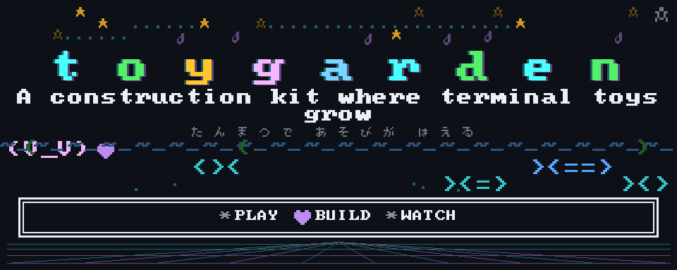
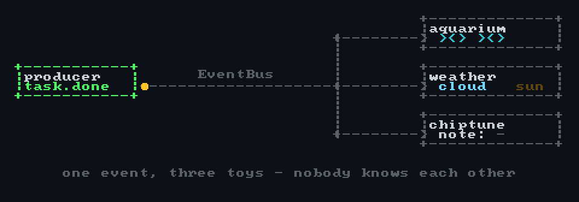
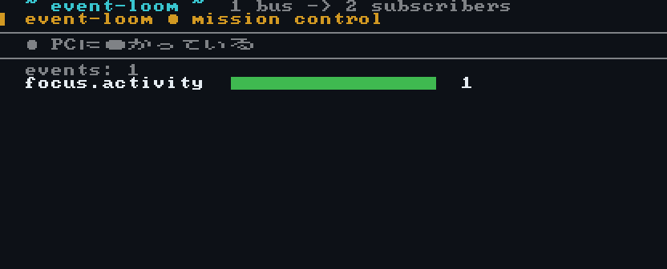
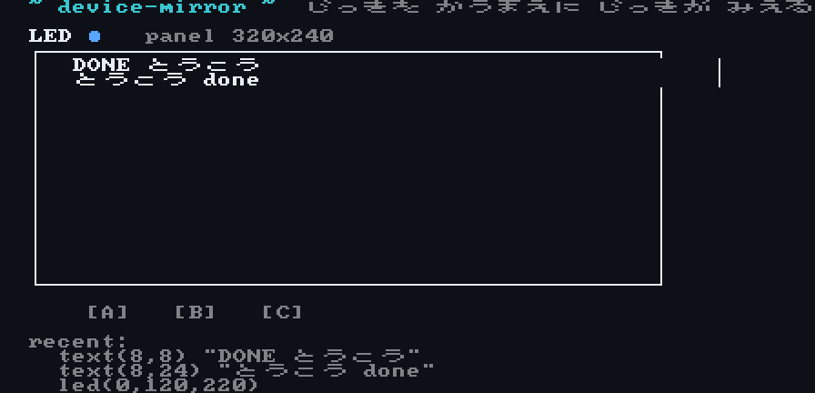
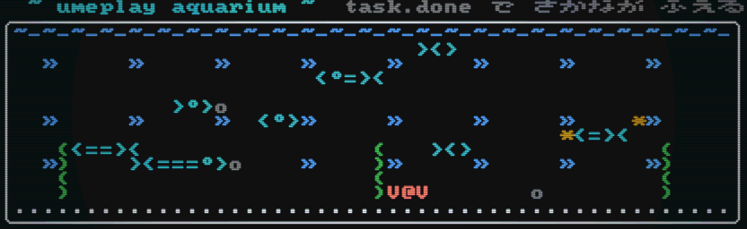
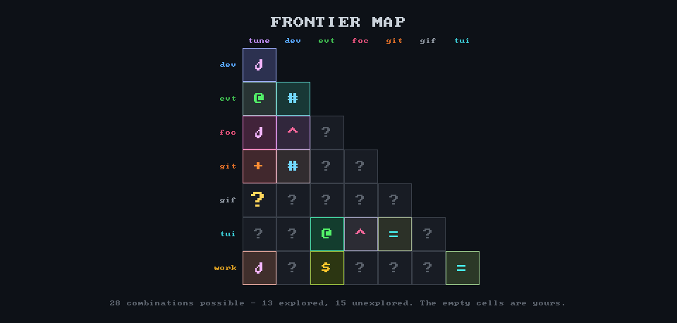

<h1 align="center"><picture><source media="(prefers-color-scheme: light)" srcset="assets/logo-light.svg"></picture></h1>

> **A construction kit where terminal toys grow.**
> 日本語版 → **[README.ja.md](README.ja.md)**

[](https://github.com/UMEBOSHIISAN/toygarden/actions/workflows/ci.yml)
[](LICENSE)
[](package.json)
[](package.json)
[](#demos-that-dont-rot)



> **This repository contains not a single screenshot.** Even the banner above is
> a GIF89a burned from code by our own encoder — run `npm run banner` and you get
> the same bytes back.

toygarden is a **zero-dependency TypeScript monorepo** where **22 terminal toys**
(an aquarium, a chiptune symphony, a tamagotchi, desk weather, a virtual M5Stack
panel…) are assembled from **10 reusable `core-*` packages** wired together by a
**single event contract**.
You don't build apps — you cross parts, and play *grows*. It's all in your
terminal: no build target, no browser, no hardware. `npm install && npm run play tamagotchi`.

## Quick start

Read this as your first day, not a command dump:

```sh
npm install              # devDeps only: typescript + vitest + esbuild
npm run hello            # a cinematic splash, then an Undertale-style greeter walks you in (TOYGARDEN_NO_SPLASH=1 to skip)
npm run tour             # sit back — all 22 toys, 8 seconds each, with save-point interludes
npm run play daily       # "today's toy": a date-seeded pick (same day → same toy)
npm run workshop         # pick parts by eye and grow a toy of your own
```

From there, the everyday commands:

```sh
npm run play             # list every toy, with taglines
npm run play tamagotchi  # names match by substring; an ambiguous name gets a numbered menu (TTY)
npm run play random      # feeling lucky? launch a random one
npm run check            # typecheck + tests — 150+, all green (the count climbs as toys land)
npm run gifs             # re-render every demo GIF from code → demo/gifs/
npm run banner           # re-render the hero banner → demo/banner.gif
npm run frontier         # re-render the combination map → demo/frontier.gif
```

> **`npx toygarden` is coming soon.** The bin entrypoint and ahead-of-time bundling
> are already in place, but the package isn't published yet — for now, clone the
> repo and use the `npm run` commands above.

Everything runs without hardware (`core-device` defaults to a mock driver).

## Choose your door

Three ways in, depending on why you're here:

- 🎮 **Terminal tinkerers** — `npm run play` lists every toy; `npm run play random`
  if you feel lucky. Want your own? Run `npm run workshop`: pick `core-*` parts by
  eye with `j`/`k`+`space`, watch the recipe diagram re-wire live, and `Enter` grows
  a toy pre-wired with those parts (pick the same parts as an existing toy and it
  tells you "same bloodline!"). Prefer the CLI? `npm run new -- my-toy` scaffolds a
  living toy in ~60 seconds — green tests, running CLI, and a rendered GIF out of the box.
- 🔌 **Gadget people (M5Stack, macropads)** — start with
  `npm run play device-mirror` to watch a virtual M5Stack panel light up in your
  terminal, then read **[docs/DEVICES.md](docs/DEVICES.md)** and write a driver in
  ~50 lines. Real hardware drivers are **wanted, not shipped** — that gap is your
  PR's opening, not an apology.
- 🤖 **Agent people** — the toys visualize how autonomous agents actually behave.
  [git-replay](demo/gifs/git-replay.gif) color-codes human vs. AI commits,
  [commit-symphony](demo/gifs/commit-symphony.gif) rings AI co-authored commits an
  octave up, and [agent-constellation](demo/gifs/agent-constellation.gif),
  [routing-radar](demo/gifs/routing-radar.gif), and
  [collapse-siren](demo/gifs/collapse-siren.gif) turn dispatch, routing, and
  collapse rates into things you can watch. The loose event design underneath is in
  [Three-layer architecture](#three-layer-architecture).

## Three-layer architecture

```
apps/*          toys        (thin — just compose cores)
   │ import only ↓
packages/core-* cores       (the reusable units)
   │ import only ↓
contracts/      types/schema (the dependency-free leaf)
```

**One-way dependencies only** (`app → core → contracts`). Apps never import each
other. They collaborate loosely through the `PlayEvent` type in
[`contracts/events.ts`](contracts/events.ts): a producer never knows who's
listening, a consumer never knows who spoke. That shared vocabulary is the spine
of the whole kit.



> **One event, three toys — nobody knows each other.** A single `PlayEvent` hits the
> bus and an aquarium, desk weather, and a chiptune all react at once, none aware the
> others exist. Drawn by `npm run diagram`, so the picture can't drift from the code.



> `npm run play event-loom` — one `EventBus`, a realistic stream of events, and
> **two decoupled subscribers** (a colored ticker and a kind-counter) reacting at
> the same time.

## Parts catalog (`packages/`)

Ten `core-*` packages. Nine of them compose the toys; the tenth,
`core-termgif`, is the meta-core that renders every demo GIF (see
[Demos that don't rot](#demos-that-dont-rot)).

| package | responsibility |
|---|---|
| [`core-events`](packages/core-events/) | event bus — decouples producers from consumers |
| [`core-device`](packages/core-device/) | device HAL (M5 / Ajazz AKP153 / mock) |
| [`core-git-observe`](packages/core-git-observe/) | git activity observation (numstat + Co-Authored-By) |
| [`core-chiptune`](packages/core-chiptune/) | 8-bit sound (square-wave PCM / WAV / motifs) |
| [`core-tui`](packages/core-tui/) | terminal UI primitives (lanes / badges / ANSI) |
| [`core-worker-data`](packages/core-worker-data/) | worker dispatch / collapse data supply (read-only) |
| [`core-focus-log`](packages/core-focus-log/) | focus-cam log (sqlite) supplied read-only |
| [`core-save`](packages/core-save/) | fail-soft, zero-dependency JSON persistence for small states in `~/.toygarden` |
| [`core-sysmon`](packages/core-sysmon/) | host workload (CPU / memory / load via `node:os`) normalized to a 0..1 busyness score |
| [`core-termgif`](packages/core-termgif/) | ANSI output → GIF. The part that keeps demos from rotting (GIF89a + LZW + a built-in 8×8 font) |

## Toy catalog (`apps/` — all 22, all with GIFs)

**Full gallery → [demo/index.html](demo/index.html)** — self-contained, filter by
core, dark/light aware, zero external references. Regenerate with `npm run showcase`.

| toy | cores crossed | what it does |
|---|---|---|
| [ascii-aquarium](demo/gifs/ascii-aquarium.gif) | contracts | An ASCII fish tank that gains a fish on every `task.done`. A moon rises at night. |
| [event-loom](demo/gifs/event-loom.gif) | events × tui | Weaves every event on one bus into a live universal viewer. |
| [commit-symphony](demo/gifs/commit-symphony.gif) | git-observe × chiptune | Your git history becomes an 8-bit tune; AI co-authored commits ring an octave up. |
| [git-replay](demo/gifs/git-replay.gif) | git-observe × tui | Time-lapse playback of a repo's history, human and AI color-coded. |
| [secretary-today](demo/gifs/secretary-today.gif) | tui | Today's priorities as lanes; blocked items sink in red. |
| [agent-constellation](demo/gifs/agent-constellation.gif) | device × events | Agents become a constellation; a dispatch draws a line between stars. |
| [collapse-arcade](demo/gifs/collapse-arcade.gif) | worker-data | High collapse-rate agents become enemies. Shooting one = a review. Your best score saves RPG-style to `~/.toygarden/save.json` — brag about it with the 🏆 issue template. |
| [collapse-siren](demo/gifs/collapse-siren.gif) | worker-data × chiptune × events | When collapse rate crosses a threshold, the terminal blares a dissonant siren. |
| [device-mirror](demo/gifs/device-mirror.gif) | device | See the hardware before you buy it: a virtual M5Stack panel in your terminal, mirroring the `DrawCommand`s a real driver would receive. |
| [desk-weather](demo/gifs/desk-weather.gif) | device | Your repo's health becomes desk weather; a dirty tree clouds over. |
| [git-weather](demo/gifs/git-weather.gif) | git-observe × device | High-churn days storm, quiet days stay clear. |
| [pomodoro-forge](demo/gifs/pomodoro-forge.gif) | chiptune × device | Mine ore by focusing, smelt it on commit — a blacksmith's pomodoro. |
| [focus-forge](demo/gifs/focus-forge.gif) | focus-log × chiptune × device | A pomodoro that isn't self-reported. Only measured focus swings the hammer. |
| [focus-aquarium](demo/gifs/focus-aquarium.gif) | focus-log | A day's focus log swims out as a school of fish at night. |
| [focus-tally](demo/gifs/focus-tally.gif) | focus-log × tui | What you did today stacks up as a terminal bar chart. |
| [ume-tamagotchi](demo/gifs/ume-tamagotchi.gif) | contracts | Raise Umeko: she's happy when you post, sulks when things stall. |
| [routing-slot](demo/gifs/routing-slot.gif) | worker-data | Worker dispatch as a slot machine; the right fit hits the jackpot. |
| [routing-radar](demo/gifs/routing-radar.gif) | worker-data × tui | A radar surveying dispatch hit-rate with confidence bars. |
| [chiptune-clock](demo/gifs/chiptune-clock.gif) | chiptune × device | A desk clock that tells the hour with an 8-bit bell. |
| [chiptune-themes](demo/gifs/chiptune-themes.gif) | chiptune × events | Each event kind gets a theme; a successful deploy plays a fanfare. |
| [commit-constellation](demo/gifs/commit-constellation.gif) | git-observe × device | Commit authors become stars; the bigger the contribution, the brighter. |
| [cpu-diner](demo/gifs/cpu-diner.gif) | sysmon | An ASCII diner run by your machine's workload: customers flood in when your CPU sweats, the staff doze when it's idle. |

Every toy is just a few files under `apps/<name>/src/`. You can add one without
touching anything else — that additivity *is* the kit.

## Bring your gadget

All 22 toys run with **zero hardware** — `core-device` defaults to a mock driver,
and that default is exactly what lets every app and every CI run work with nothing
plugged in. But the `Device` HAL is real: a small screen and a button is enough to
make toygarden drive a physical panel.



> `npm run play device-mirror` — *see the hardware before you buy it.* A virtual
> M5Stack Core panel (real 320×240 resolution, `[A][B][C]` buttons, an LED) rendered
> in your terminal, mirroring the exact `DrawCommand`s a real driver would receive.

Writing a driver is ~50 lines: implement six methods, add one `case` to
`select.ts`, and every existing toy runs against your gadget unmodified. Real
M5Stack and Ajazz AKP153 drivers are **wanted, not shipped** — the interface tour,
the ~50-line walkthrough, and the PR checklist are in
**[docs/DEVICES.md](docs/DEVICES.md)**.

## Human × AI, and the repo knows it

toygarden was built by a human and AI agents working side by side, and the git history
still carries the `Co-Authored-By` trailers that prove it. That isn't a footnote
here — it's playable. [commit-symphony](demo/gifs/commit-symphony.gif) sings this
repo's own log, ringing the AI co-authored commits an octave up;
[git-replay](demo/gifs/git-replay.gif) replays the same history with human and AI
contributions color-coded. The toys that visualize collaboration are pointed at the
collaboration that made them.

## Demos that don't rot

A screen-recorded GIF turns into a lie the moment the code changes. Every GIF in
toygarden is made like this instead:

```
app's demo()  ──ANSI frames──▶  core-termgif  ──▶  demo/gifs/<name>.gif
(seeded RNG, deterministic)     (GIF89a + LZW + 8×8 font, zero deps)
```

- Each app exports `demo(): DemoSpec` from `src/demo.ts` (the convention lives in
  [`packages/core-termgif/README.md`](packages/core-termgif/README.md)).
- `npm run gifs` re-renders every app's GIF plus `manifest.json`; `npm run showcase`
  rebuilds the gallery HTML; `npm run banner` rebuilds the hero.
- Same code → same GIF. **Demo freshness = repository honesty.**
- **Optional CRT look** — `npm run gifs -- --crt ascii-aquarium` re-renders any toy
  through a self-written scanline/glow/vignette post-pass (the cool-retro-term
  aesthetic, our own code) into `demo/crt/`. It never touches the canonical
  `demo/gifs/` or `manifest.json` — it's purely additive.



The font is a public-domain IBM-VGA-era bitmap ([dhepper/font8x8](https://github.com/dhepper/font8x8))
plus hand-drawn glyphs. Even hiragana swim across the tank.

## Grow your own toy

A new toy takes about 60 seconds to scaffold:

```sh
npm run new -- my-toy    # generates apps/my-toy/ (6 files: package.json,
                         # tsconfig, src/index.ts, src/cli.ts, src/demo.ts, test)
npm run check            # typecheck + tests — green out of the box
npm run play my-toy      # watch it run (Ctrl+C to quit)
npm run gifs -- my-toy   # render demo/gifs/my-toy.gif
```

The generated toy already passes `check`, runs under `play`, and renders a GIF —
so you start from something alive and reshape it. From there, add a `@toygarden/*`
core to its `package.json` and cross parts to taste. Full guide (and how to add a
new core, device, or event): **[CONTRIBUTING.md](CONTRIBUTING.md)**.

## Combination Frontier

The 10 `core-*` parts can pair up **45 ways** — and most of those cells are still
empty. This map is computed from `manifest.json` by `npm run frontier`, so it can't
lie: a cell only lights up when a real toy actually crosses those two parts, and the
map **re-draws itself every time a new part lands**. The dark cells with a blinking
`?` are the combinations nobody has built yet.



> **45 combinations possible, most of them still empty. The blank cells are yours.**

Here are six ideas sitting in empty cells right now. None of them ship today — they're
invitations, each one an `npm run new` away:

| idea | cross these two | what it'd do |
|---|---|---|
| **Sweaty Console** | `worker-data × device` | agent collapse rate makes a real panel's LED pulse red |
| **TUI Rave** | `tui × chiptune` | drawing bars lock to 8-bit sound — a terminal turned visual instrument |
| **Commit Flipbook** | `git-observe × termgif` | a day of commits flip-booked into one shareable GIF |
| **Whisper Bus** | `events × focus-log` | a broken focus streak emits a "sigh" event that ripples across every toy |
| **Panel Deck** | `device × tui` | your secretary's priority lanes, mirrored onto a physical M5Stack panel |
| **Blame Radar** | `git-observe × worker-data` | cross commit authorship with dispatch data — see which agent actually shipped what |

A new **part** widens the frontier faster than a new toy: add one `core-*` and it can
pair with every existing part at once — a whole new row of empty cells to fill.
[Grab a `toy-idea`](../../issues/new?template=toy-idea.yml) or
[propose a core](../../issues/new?template=new-core.yml).

## The kit grows

toygarden isn't a finished box of toys — it's a kit that keeps sprouting new ones.
There are four ways to make it grow, and they compound:

- 🧸 **A new toy** — `npm run new -- my-toy` scaffolds a living app in ~60 seconds.
  One toy = a few files under `apps/`, added without touching anything else. Stuck for
  an idea? Your first one can come from a prompt — [browse the `toy-idea` issues](../../issues?q=is%3Aissue+is%3Aopen+label%3Atoy-idea) and build one.
- 🧩 **A new core (part)** — this is the one with leverage. A single new `core-*`
  package doesn't add *one* thing; it multiplies with every toy that crosses it.
  Cross it with three existing cores and you've got new combinations for free —
  that combinatorial blow-up is what the kit is actually made of.
- 🔌 **A new device driver** — implement six methods and every existing toy runs on
  your gadget, unmodified. Real hardware drivers are wanted, not shipped:
  **[docs/DEVICES.md](docs/DEVICES.md)**.
- 📡 **A new event** — add one line to the `PlayEvent` type in
  [`contracts/events.ts`](contracts/events.ts) and every producer and consumer
  gets it for free. The shared vocabulary widens for the whole kit at once.

> **From the owner (umeboshi):** I'm not shipping this and walking away. I'll keep
> adding parts and toys to it myself — that's the point. Think of this repo less
> as a product and more as a garden I keep planting in, and you're welcome to plant
> next to me. If you build a toy, a part, or a driver, I want to see it.

So show it to us. Open an issue with the idea, or send a PR:

- 🧸 [Suggest a toy](../../issues/new?template=toy-idea.yml) ·
  🧩 [Propose a new core](../../issues/new?template=new-core.yml) ·
  🔌 [Bring a device driver](../../issues/new?template=device-driver.yml) ·
  🏆 [Brag a collapse-arcade score](../../issues/new?template=high-score.yml)
- PRs welcome — the checklist is in [CONTRIBUTING.md](CONTRIBUTING.md) and the
  [pull request template](.github/PULL_REQUEST_TEMPLATE.md).

## Testing

```sh
npm run check   # tsc --noEmit + vitest (cores tested seriously, apps are smoke tests)
```

`demo/wiring.test.ts` proves one event reaches four apps through loose coupling;
`demo/showcase.test.ts` renders every app for real; `core-termgif`'s LZW is
round-tripped against an independent decoder. **150+ tests, all green — and the count
climbs with every toy, part, and CRT/frontier renderer added.**

## Contributing

Read **[CONTRIBUTING.md](CONTRIBUTING.md)**. The only rules that matter: keep the
dependency direction (`apps → cores → contracts`), never import one app from
another, and keep demos deterministic. `npm run new` gets you a valid toy in one
command.

## License

MIT — see [LICENSE](LICENSE). The bitmap font's provenance is public domain
(see [`core-termgif/README.md`](packages/core-termgif/README.md)).
